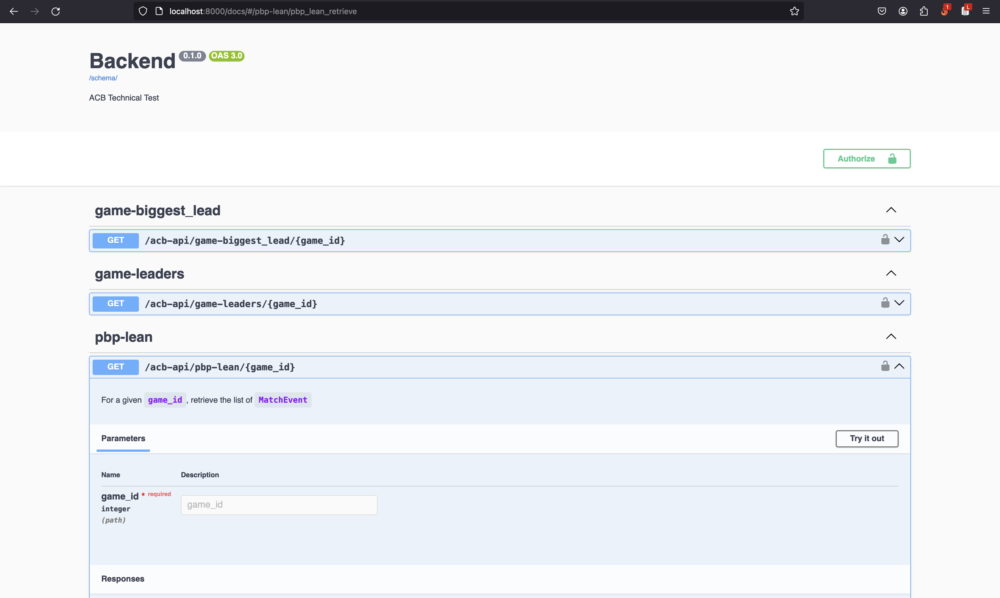
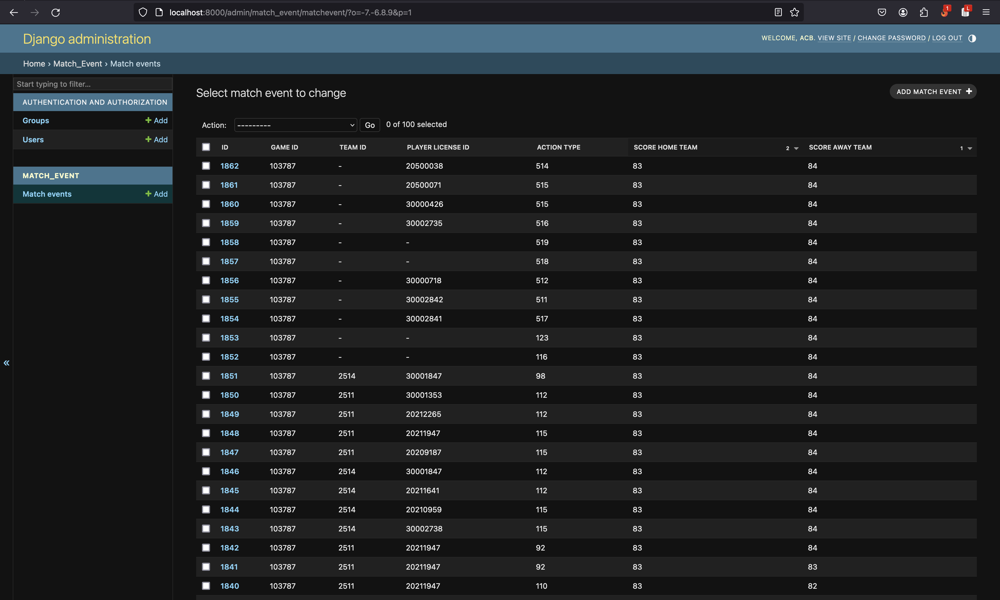

# ACB Technical Test

## Technologies
* Python
* Django
* PostgreSQL
* Docker (& docker-compose)

## Setting it up
1. Start up the server with docker-compose in your terminal from the root of the project (i.e. `acb/`):
```console
sudo docker-compose up backend
```
2. Open a new terminal and connect to the backend:
```console
sudo docker-compose exec backend bash
```
3. From there, run the migrations:
```console
python manage.py migrate
```
4. Finally, create a superuser (take into account that you will use this credentials to perform API calls):
```console
python manage.py createsuperuser
```

## API

The API is documented in http://localhost:8000/docs, as shown in the following image:




You can test the endpoints here, but you will be prompted to introduce your credentials defined above.


## Running the tests

In order to run the tests, follow these steps:
1. Open a new terminal and connect to the backend:
```console
sudo docker-compose exec backend bash
```
2. From there, run the tests:
```console
python manage.py test
```

## Admin

The Admin panel is available http://localhost:8000/admin:




## And now?

What follows is a series of suggestions that could be in order to improve the service:
* Cache the response of the endpoints (e.g. using Redis), so that database calls are reduced.
* Paginate the response from the `pbp-lean` endpoint, since not all events may be required.
* Model the database according to the domain, to improve its understandability (e.g. creating a model for players, another for action_types, etc.).
